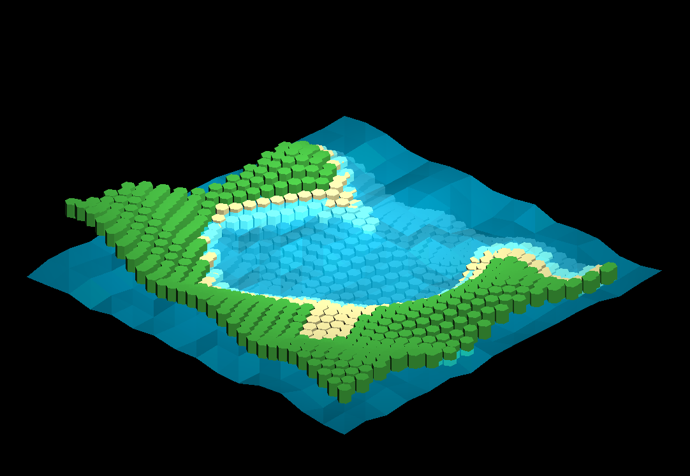

# Experiment: Giant's Causeway
Procedural hexagonal terrain inspired by the [Giant's Causeway](https://en.wikipedia.org/wiki/Giant%27s_Causeway) in Northern Ireland. Terrain is composed of an array of basalt-like columns which shift vertically to represent a translating terrain / map.

